# SageMaker Notebooks Data Engineering with SageMaker Canvas Auto ML

This project will discuss a continuation on from Lab 4 of the [Accelerate data engineering on AWS with Amazon Q Developer](https://catalog.us-east-1.prod.workshops.aws/workshops/2c7b3627-a1f8-4310-8e5b-211b306d10d9/en-US/lab4/sagemaker)

## Introduction

Welcome to this hands-on lab where we'll explore the power of Amazon SageMaker in solving real-world data engineering and machine learning challenges. In this session, we'll step into the role of a data engineer working for a ride-sharing company operating in New York City. Our mission is to analyze the factors influencing passenger tipping behavior and build a machine learning model to predict the likelihood of a passenger leaving a tip based on various trip features.

Using the New York City Taxi and Limousine Commission (TLC) dataset, which includes detailed information about yellow taxi trips, we'll leverage Amazon SageMaker's comprehensive suite of tools to process, analyze, and model this data. We'll work with two key datasets: the Yellow Taxi Trip Records and the Taxi Zone Lookup Table, combining them to create a rich feature set for our predictive model.

Throughout this lab, we'll utilize various components of Amazon SageMaker, including Notebooks, Studio, Canvas, and Auto ML. We'll take you through the entire machine learning lifecycle, from data preparation and feature engineering to model training and evaluation. By the end of this session, you'll have hands-on experience in building a sophisticated machine learning solution that can provide valuable insights for our ride-sharing company, potentially improving driver earnings and customer satisfaction.

Let's dive in and discover how Amazon SageMaker can accelerate our data engineering and machine learning workflows in this exciting real-world scenario.

This repo contains the SageMaker Studio Jupyter Notebook from the lab with a slight edit to account for the continuation where we will save multiple datasets to be used with the Auto ML job in SageMaker Canvas. 

## Step 1: Running Sagemaker Notebook using Jupyter Lab

The instructions for Step 1 are outlined in Lab 4 of the workshop. Once you login to SageMaker Studio, click on Jupyter Lab (either creating a new one or using the existing one from the workshop) and upload the Auto-ML notebook. Run all the cells sequentially and confirm that you have the appropriate files stored in S3. 

Remember, if you are not using the workshop to configure your accounts then you will need to create the appropriate bucket and folders to properly store the files otherwise you will need to adjust the jupyter notebook to account for the custom S3 structure you provide.

You may also need to configure the appropriate IAM read and write permissions for the notebook to access the S3 bucket if you are not using the workshop.

(Note: Once data is stored in S3, you are ready to move on)

(Note: The training, validation, and test_no_labels sets will also be provided in the data folder if you would rather go through the Auto ML steps without performing data engineering)

## Step 2: Create a SageMaker Auto ML model

### Part 1: Create a Data Flow using Data Wrangler
Select Import and Prepare -> Tabular

Select the appropriate train and validation sets from S3. This is what we will use to train our model!

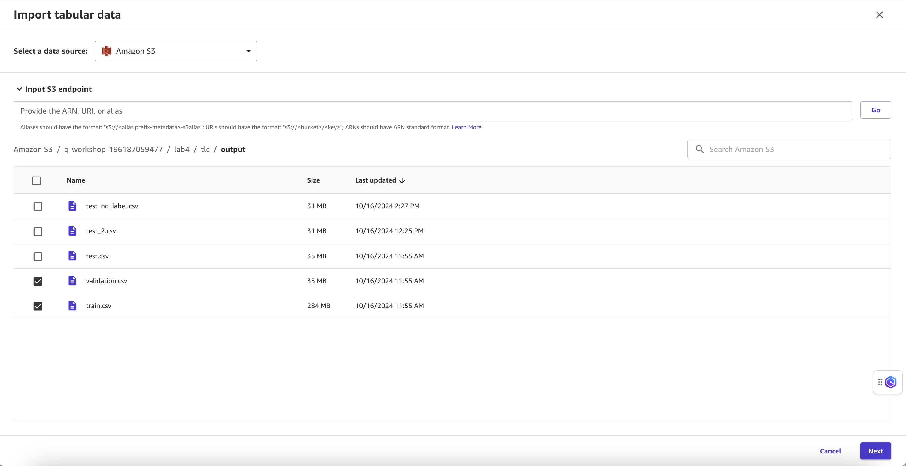

Ensure previewing the data shows the correct information and then select import.

Navigate to the Data Wrangler -> Data Flow tab and you should see your newly created Data Flow

### Part 2: Model Creation

Now we will begin creating the model. Select the three dots next to Data Types and select Create Model

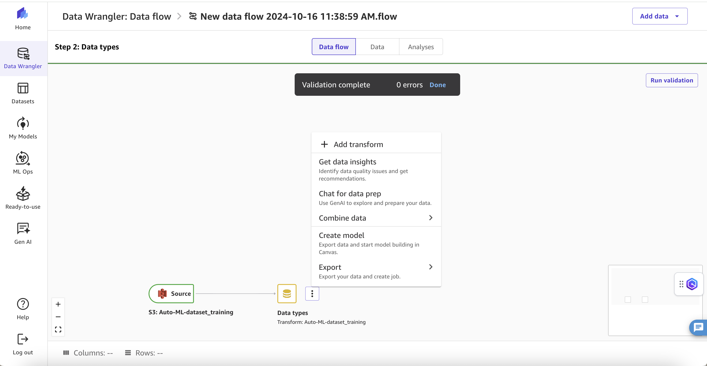

Select the Target Column as `tip_percentage`

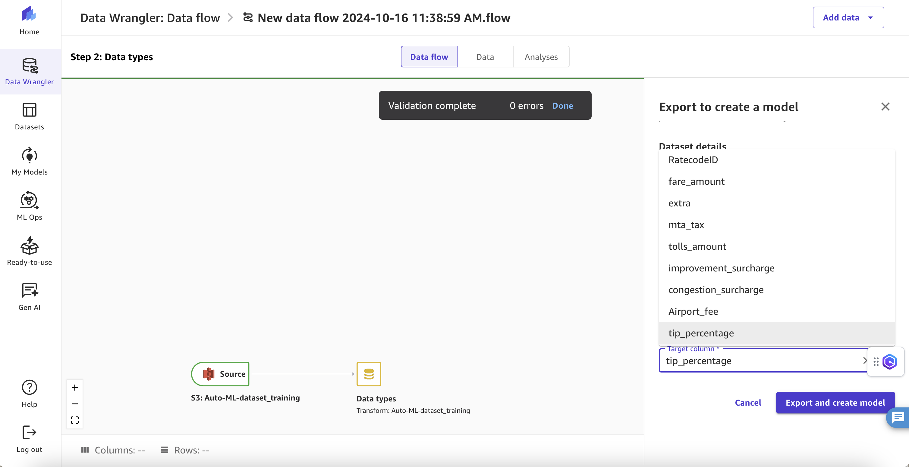

Provide a good name for the Dataset and for the Model and make sure the problem type is set to prediction

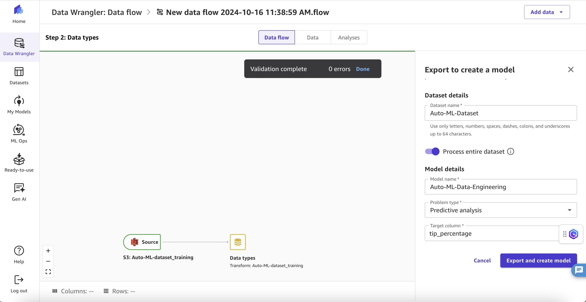

Once the model is created, navigate back to our Data Flow to view the new pipeline

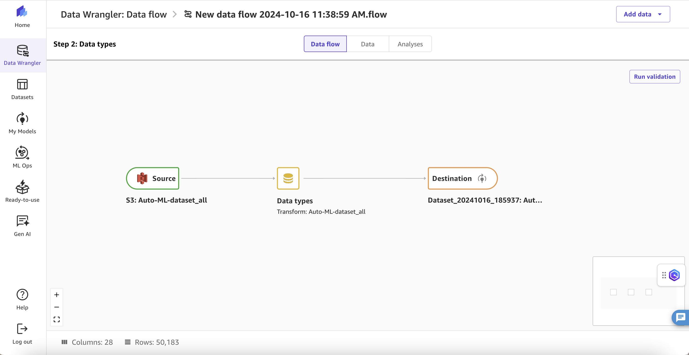

From there, you can navigate to My Models tab on left hand side to view the new model there as well.

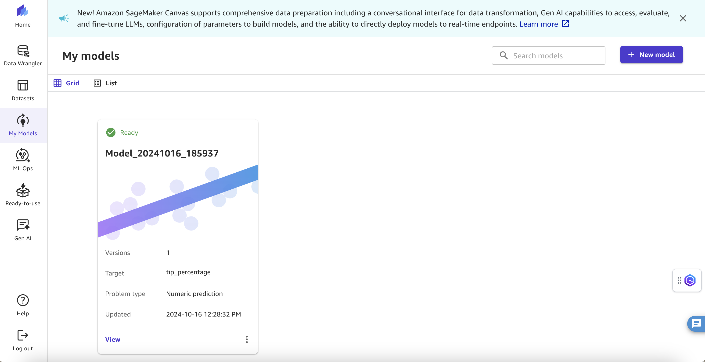

Go ahead and select the new Model and we will begin to Analyze the data

### Part 3: Data Visualization and Model Building

For part 3, we will begin viewing the relationships between our data columns and we will also train our Auto ML model for prediction using the Standard Build feature.

Select the Data Visualizer Tab to pull up a visualization of the correlation between variables in our data

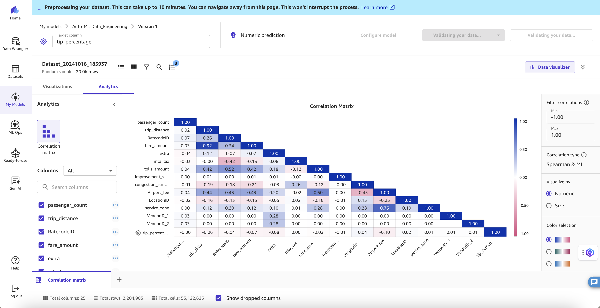

This allows us to see how variables relate to one another. If variables have a high number such as fare amount and trip distance then it means the variables are pretty dependent on one another. This makes sense as your fare is generally going to depend on how far you traveled.

Navigate back to model page

Now you can either choose to preview the model to get a general sense of what it will do as well as what columns are most impactful to the prediction or you can start the Standard Build. The Standard Build will take longer than the preview or the Quick Build but should provide a higher accuracy.

Use the dropdown to configure the build type.

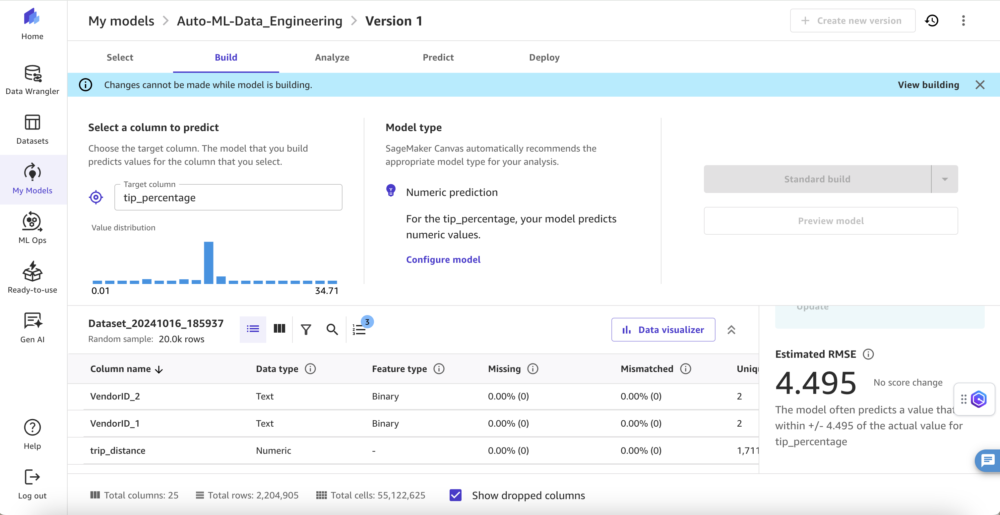

This process should take around 2-4 hours if you chose to run a standard build. The greyed out buttons means the Model is building.

### Part 4: Analyze

Once the Model has completed the build process, you should be able to navigate to the Analyze screen.

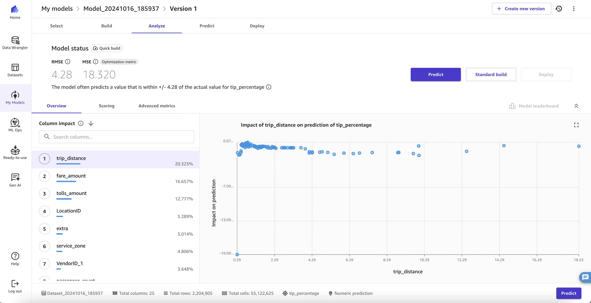

This page shows us the RMSE (Root Mean Squared Error) for our model as well as the most impactful variables on prediction. These may change with your own building of the model depending on what the model deems most impactful.

### Part 5: Predict

Now that our model has been built, its time to test it with some of our own inputs. 

Navigate to the Predict Page.

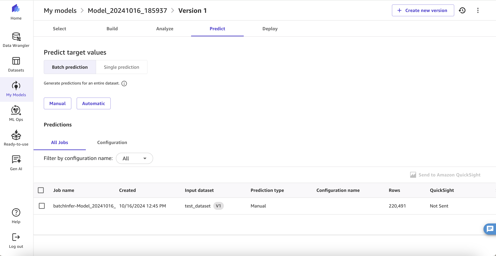

Here is the page where we will perform our predictive analysis of our model to see how well it performs on our own test cases.

We have two options, Batch prediction or single prediction. I will go over in Part 5.5 how to create a batch manual prediction job but for now we will use the single prediction feature.

Select single prediction.

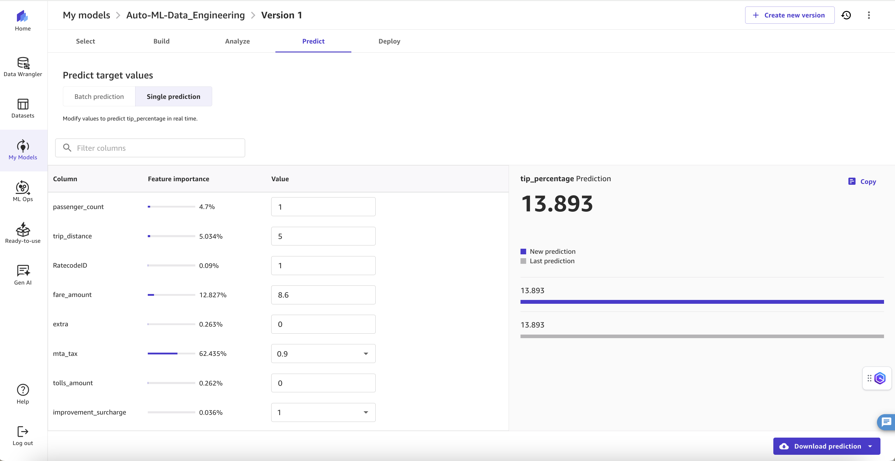

Now you can update the values in the spaces below with appropriate values and see how much of an impact they had on the overall prediction for tip percentage

For example, I updated the `mta_tax` variable to have a value of `0.9` and it had a `62.4%` impact on predicting `tip_percentage`

You can continue to play around with these values to evaluate the accuracy of your model and the effect each variable had on the prediction

### Part 5.5: Batch Prediction (Optional)

Navigate back to the data flow page and click on import tabular data again. Click through the s3 folder stucture and select the `test_no_labels.csv` file.

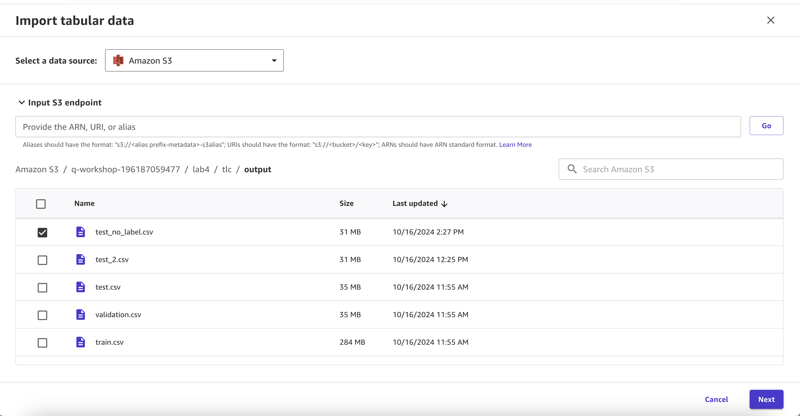

You can preview the data to ensure their is no `tip_percentage` column as this is the column the model will be predicting.

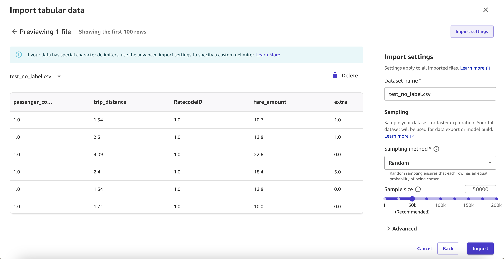

select import to import the data.

Navigate back to the Data Flow page and click the 3 dots on the newly created Data Types of the Data Source and select Export -> Export data to Canvas dataset

Give the dataset an appropriate name and click create.

Navigate back to the Data Flow page to view the newly created dataset

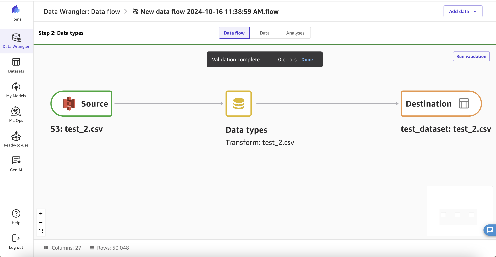

Navigate to the predictions page by selecting My Models -> The model you created -> predictions tab -> batch predictions -> Manual -> and select the dataset you previously created with the test data.

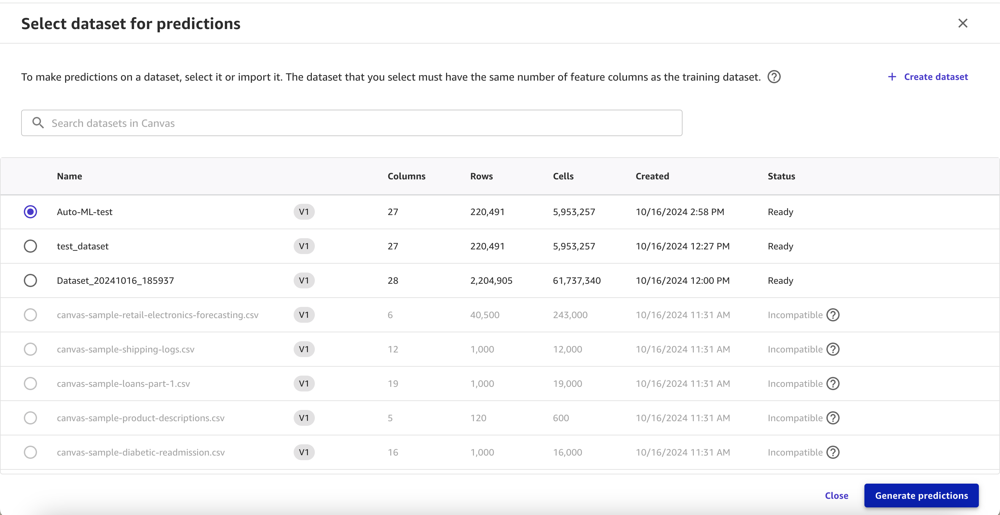

Once the model finishes generating the predictions, you should be able to see the completed job in the All Jobs table. Here you can click on the job and view the inference results.

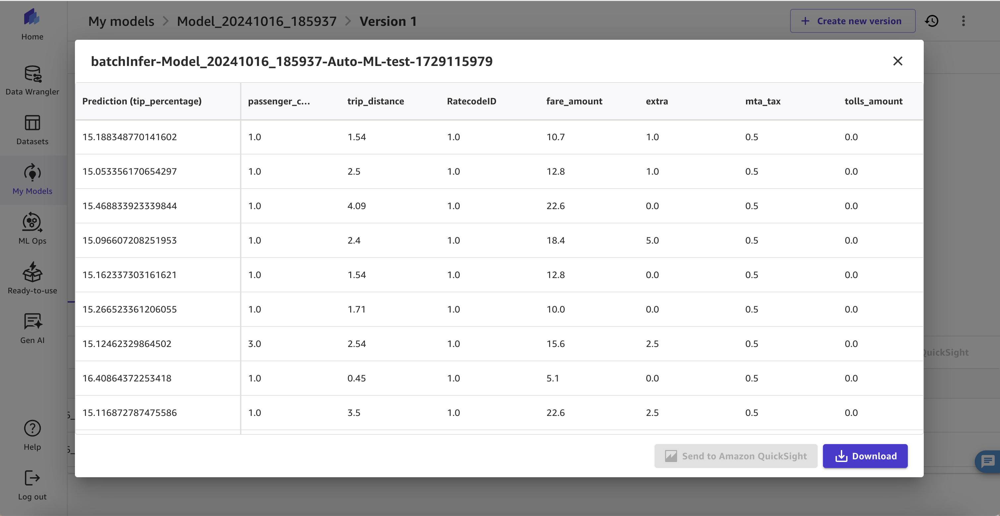

## Conclusion

In this lab, we successfully demonstrated the power and versatility of Amazon SageMaker's suite of tools in handling complex data processing and machine learning tasks. We began by integrating two different data formats - CSV and Parquet - showcasing SageMaker's ability to work with diverse data sources. Through feature engineering and enrichment, we enhanced the quality and relevance of our dataset, preparing it for machine learning applications.

The use of various SageMaker components - Notebooks, Studio, Canvas, and Auto ML - highlighted the platform's comprehensive approach to the machine learning lifecycle. This integrated ecosystem allowed us to move from data preparation to model training and deployment.

Our final model, trained to predict tip percentages for New York City taxi rides, achieved an RMSE of 4.28, indicating a reasonably good fit considering the sparsity of the data. The model utilized 24 features, with trip_distance being the most influential, accounting for 20.32% of the prediction importance, followed by fare amount at 16.66%. This insight provides valuable information about the key factors affecting tipping behavior.

The scale of this project was significant, with the training set containing over 49 million examples. Despite this large dataset, the entire lab could be completed in about 2-3 hours, with the model training phase taking anywhere from a couple of minutes to over an hour. This demonstrates the efficiency and scalability of SageMaker's Auto ML capabilities in handling large datasets.

This lab not only achieved its technical objectives but also demonstrated the accessibility and efficiency of SageMaker in handling end-to-end machine learning projects, from data processing to model deployment and inference generation. The ability to process such a large dataset and train a model with meaningful results in a relatively short time frame underscores the power of cloud-based machine learning tools like SageMaker.

In conclusion, this project showcases the practical applications of machine learning in real-world scenarios, providing valuable insights into tipping behavior that could benefit both drivers and ride-sharing companies. It also showcases how Amazon SageMaker can be leveraged to quickly and effectively develop machine learning solutions for complex problems with large datasets.