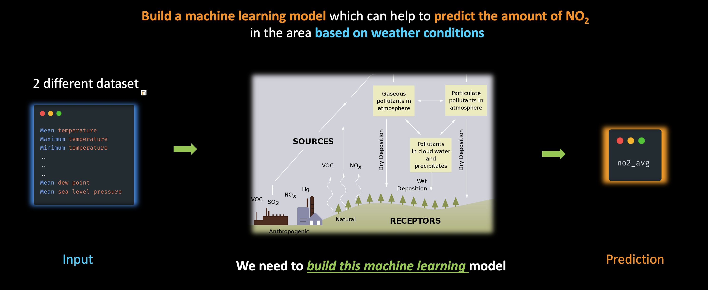

# Serverless Data Prep with Glue Interactive Sessions (from `SageMaker Studio`)

This notebook demonstrates the ability to use Apache Spark using AWS Glue to do data prep with two different datasets in order to build an urban air quality predictor with Amazon SageMaker.

# Introduction

While some organizations see data science, data engineering, and data analytics as separate siloed functions, we're increasingly seeing with many of our customers that data prep and analytics are foundational components of ML workflows.

For example, although organizations have data engineering teams to clean and prepare data for analytics and ML, the specific data that a data scientist may need for training a specific model may not be available in the repository of data that a data engineering team may have prepared.

# Problem Statement

Lets take a problem and try to solve it. As we all know, Air pollution in cities can be an acute problem leading to damaging effects on people, animals, plants and property.

We need to build a machine learning model which can help to predict the amount of NO2 in the area based on weather conditions

So, ultimately we would like to have a ML model, wherein we are going to feed the weather details of a particular city at a given time, These details would be, mean temperature, maximum temperature, minimum temperate and so on.

And the Model should predict the NO2 or nitrogen dioxide concentration levels at that time.

# Dataset

For this demo we would use the following dataset:

- [OpenAQ physical air quality data](https://registry.opendata.aws/openaq/) : Global, aggregated physical air quality data from public data sources provided by government, research-grade and other sources.
    42GB of Data

- [NOAA Global Surface Summary of Day](https://registry.opendata.aws/noaa-gsod/) : Global summary of day data for 18 surface meteorological elements are derived from the synoptic/hourly observations contained in USAF DATSAV3 Surface data and Federal Climate Complex Integrated Surface Hourly (ISH).

# Code

Follow the notebook in sequence:
1. [Data preparation using AWS Glue with Spark](code/1.DataProcessingGlue.ipynb)
2. [ML Model training and deployment using Amazon SageMaker](code/2.ModelBuildingDeployment.ipynb)
