# Build a managed analytics platform for an ecommerce business on AWS 

With the increase in popularity of online shopping, building an analytics platform for ecommerce is important for any organization, as it provides insights about the business, trends, and customer behavior. But, more importantly, it can uncover hidden insights that can trigger revenue-generating business decisions and actions. In this blog, we will learn how to build a complete analytics platform in batch and real-time mode. The real-time analytics pipeline also shows how to detect distributed denial of service (DDoS) and bot attacks, which is a common requirement for such use cases.

## Introduction 

E-commerce analytics is the process of collecting data from all of the sources that affect a certain online business. Data Analysts or Business Analysts can then utilize this information to deduce changes in customer behavior and online shopping patterns. E-commerce analytics spans the whole customer journey, starting from discovery through acquisition, conversion, and eventually retention and support.

In this two part blog, we will use an eCommerce dataset from Kaggle to simulate the logs of user purchases, product views, cart history, and the user’s journey on the online platform to create two analytical pipelines:

**Batch Processing**  

The `Batch processing` will involve data ingestion, Lake House architecture, processing, visualization using Amazon Kinesis, Glue, S3, and QuickSight to draw insights regarding the following:

- Unique visitors per day

- During a certain time, the users add products to their carts but don’t buy them

- Top categories per hour or weekday (i.e. to promote discounts based on trends)

- To know which brands need more marketing

**Real-time Processing** 

The `Real-time processing` involves detecting Distributed denial of service (DDoS) and Bot attacks using AWS Lambda, DynamoDB, CloudWatch, and AWS SNS.

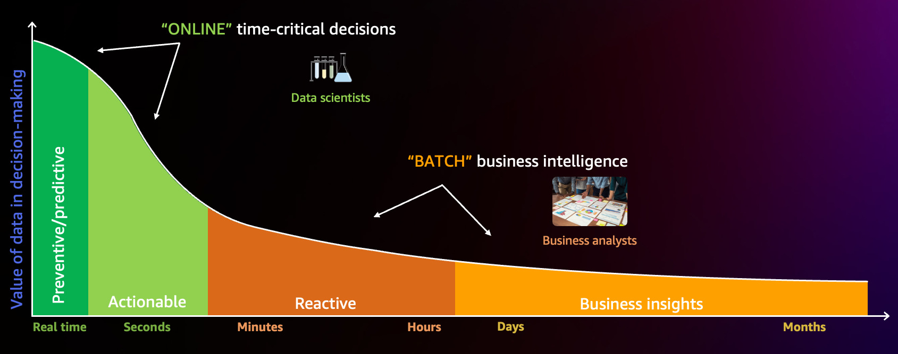

This is the first part of the blog series, where we will focus on the **Real-time processing** data pipeline. 

## Dataset 

For this blog, we are going to use the [eCommerce behavior data from multi category store](https://www.kaggle.com/datasets/mkechinov/ecommerce-behavior-data-from-multi-category-store)

This file contains the behavior data for 7 months (from October 2019 to April 2020) from a large multi-category online store.

Each row in the file represents an event. All events are related to products and users. Each event is like many-to-many relation between products and users.

## Architecture 

**Real-time Processing**  

We are going to build an end to end data engineering pipeline where we will start with this [eCommerce behavior data from multi category store](https://www.kaggle.com/datasets/mkechinov/ecommerce-behavior-data-from-multi-category-store) dataset as an input, which we will use to simulate or mimic real time e-commerce workload. 

This input stream of data will be coming to an Amazon Kinesis Data Stream, which will send the data to Amazon Kinesis Data Analytics (`stream1`), where we use an Flink application to detect any DDoS attack, and the filtered data will be send to another Amazon Kinesis Data Stream (`stream2`). 

We are going to use SQL to build the `Apache Flink` application using Amazon Kinesis Data Analytics, and hence we would need a metadata store, for which we are going to use AWS Glue. 

And then this `stream2` will trigger an AWS Lambda function which will send an Amazon SNS notification to the stakeholders and shall store the fraudulent transaction details in a DynamoDB table. 

So, the architecture would look like this. 

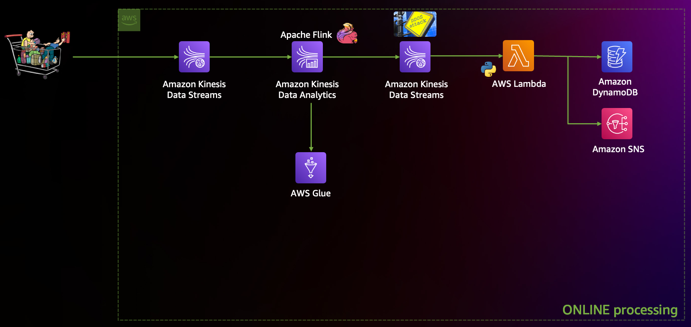

**Batch Processing** 

If we look into the architecture diagram above, we will see that we are not storing the `raw` incoming data anywhere, whatever data is coming from the `stream1` we are passing it to Amazon Kinesis Data Analytics to analyze. And it might happen that later on we discover some bug in our `Apache Flink` application, and at that point, we can fix the bug and resume processing the data, but we can not process the old data (which was processed by our buggy `Apache Flink` application, since we have not stored the raw data anywhere which we can revisit)

And thats why its always recommended to alway have a copy of the `raw` data stored in some storage (e.g. on Amazon S3) so that we can revisit the data if needed for reprocessing and/or for batch processing. 

And this is exactly what we are going to do, we will use the same incoming data stream from Amazon Kinesis Data Stream (`stream1`) and pass it on to Amazon Kinesis Firehose which can write the data on Amazon S3. 

Now we can have the `raw` incoming data on Amazon S3, and we can use AWS Glue to catalog that data and using AWS Glue ETL to process or clean that data which we can further use by Amazon Athena to run any analytical queries. 

At last we would leverage Amazon QuickSight to build a dashboard for visualization.  

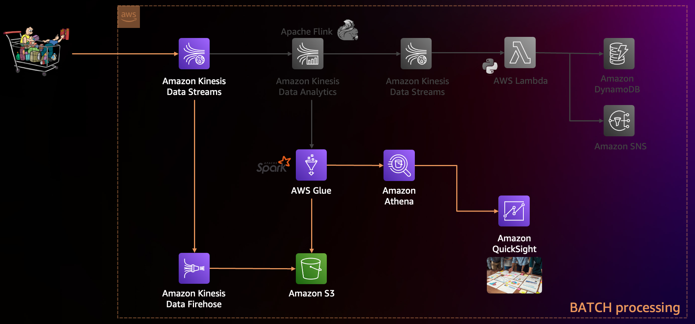

## Step by step walk through

Lets build this application step by step. We are could to use an [AWS Cloud9 instance](https://aws.amazon.com/cloud9/), but it is not mandatory to use for this project. But if you wish to spin up an AWS Cloud9 instance, you may like to follow steps mentions [here](https://docs.aws.amazon.com/cloud9/latest/user-guide/create-environment-main.html) and proceed further. 


### Download the dataset and clone the GirHub Repo 

Clone the project and change it to the right directory:

```bash

# Project repository 
git clone https://github.com/debnsuma/build-a-managed-analytics-platform-for-ecommerce-business.git

cd build-a-managed-analytics-platform-for-ecommerce-business/

# Create a folder to store the dataset 
mkdir dataset 

```

Download the dataset from [here]((https://www.kaggle.com/datasets/mkechinov/ecommerce-behavior-data-from-multi-category-store)) and move the downloaded `2019-Nov.csv.zip` under the `dataset` folder  

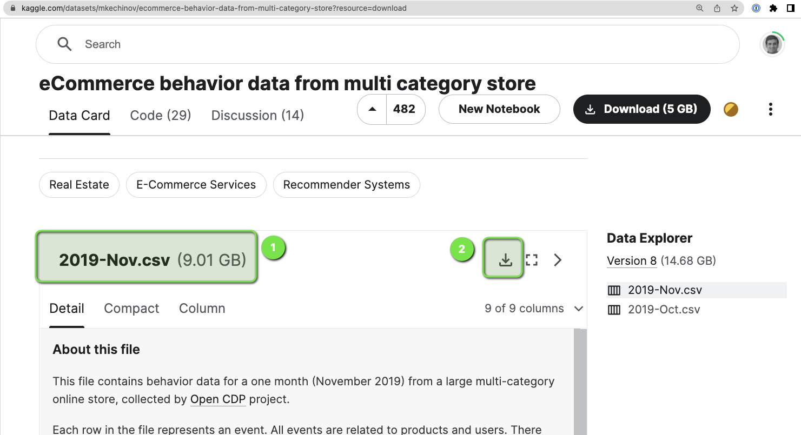

Now, lets unzip the file and create a sample version of the dataset by just taking the first `1000` records from the file. 

```bash

cd dataset 

unzip 2019-Nov.csv.zip

cat 2019-Nov.csv | head -n 1000 > 202019-Nov-sample.csv

```

### Create an Amazon S3 bucket 

Now we can create an Amazon S3 bucket and upload this dataset 

- Name of the Bucket : `ecommerce-raw-us-east-1-dev` (replace this with your own `BUCKET_NAME`)

```bash

# Copy all the files in the S3 bucket 
aws s3 cp 2019-Nov.csv.zip s3://<BUCKET_NAME>/ecomm_user_activity/p_year=2019/p_month=11/
aws s3 cp 202019-Nov-sample.csv s3://<BUCKET_NAME>/ecomm_user_activity_sample/202019-Nov-sample.csv
aws s3 cp 2019-Nov.csv s3://<BUCKET_NAME>/ecomm_user_activity_unconcompressed/p_year=2019/p_month=11/

```

### Create the Kinesis Data Stream 

Now, lets create the first Kinesis data stream which we will be using as the incoming stream. Open the AWS Console and then:

- Go to **Amazon Kinesis** 
- Click on **Create data stream** 

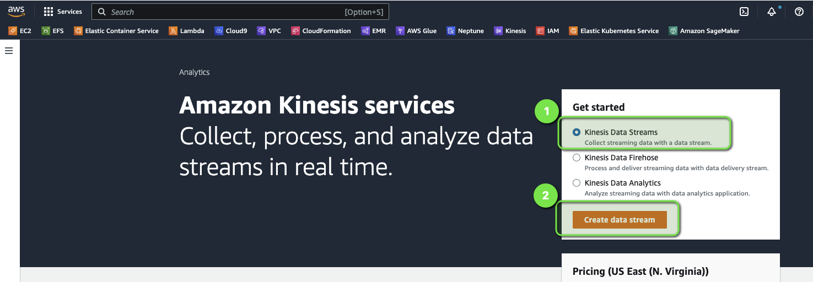

- Put `ecommerce-raw-user-activity-stream-1` as the Data stream name
- Click on **Create data stream** 

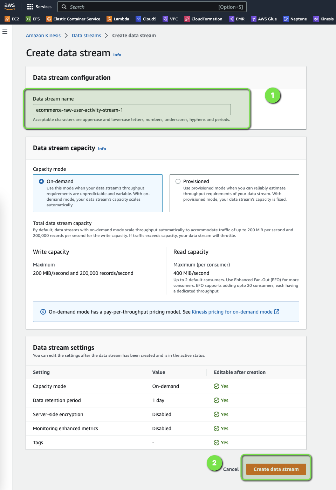


Lets create another Kinesis data stream which we are going to use later on. This time use the Data stream name as `ecommerce-raw-user-activity-stream-2` 

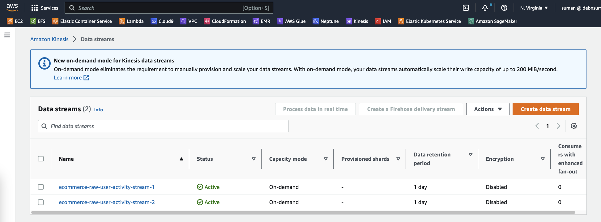

### Start the e-commerce traffic 

Now that we have our **Kinesis Data Stream** is ready we can start the e-commerce traffic using a stimulator. This stimulator (a `python script`) reads the `202019-Nov-sample.csv` (the dataset which we downloaded) line by line and send it to the Kinesis data stream. 

But before you run the stimulator, just edit the `stream-data-app-simulation.py` with your *<BUCKET_NAME>*


```python

# S3 buckect details (UPDATE THIS)
BUCKET_NAME = "ecommerce-raw-us-east-1-dev"       
```

Once its updated, we can run the stimulator. 

```bash 
# Go back to the project root directory 
cd .. 

# Run stimulator 
pip install boto3
python code/ecomm-simulation-app/stream-data-app-simulation.py 

HttpStatusCode: 200 ,  electronics.smartphone
HttpStatusCode: 200 ,  appliances.sewing_machine
HttpStatusCode: 200 ,  
HttpStatusCode: 200 ,  appliances.kitchen.washer
HttpStatusCode: 200 ,  electronics.smartphone
HttpStatusCode: 200 ,  computers.notebook
HttpStatusCode: 200 ,  computers.notebook
HttpStatusCode: 200 ,  
HttpStatusCode: 200 ,  
HttpStatusCode: 200 ,  electronics.smartphone

```

### Integration with Kinesis Data Analytics and Apache Flink

Now, we will create an Amazon Kinesis Data Analytics Streaming Application. Open the AWS Console and then:

- Go to **Amazon Kinesis** 
- Select **Analytics applications** 
- Click on **Studio notebooks** 
- Click on **Create Studio notebook**

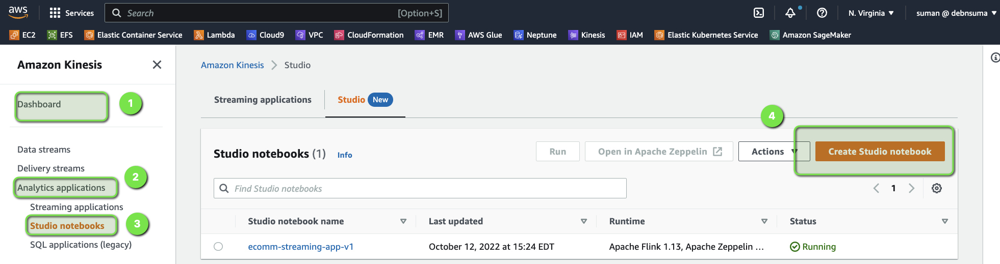

- Use `ecomm-streaming-app-v1` as the **Studio notebook name** 
- Under the **Permissions** section, click on `Create` to create an AWS Glue database, name the database as `my-db-ecomm` 
-  Use the same database, `my-db-ecomm` from the dropdown 
- Click on **Create Studio notebook** 

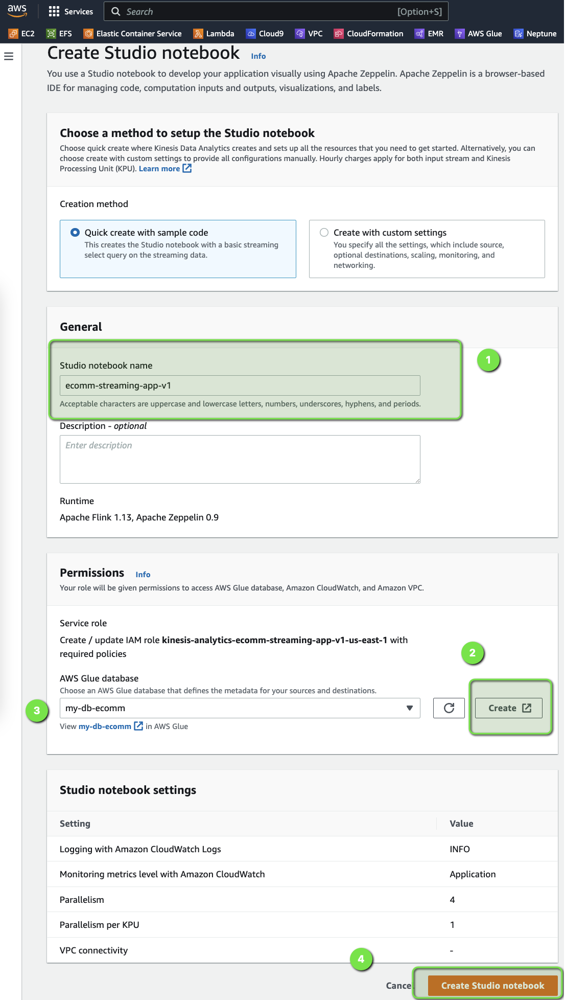

Now, select the `ecomm-streaming-app-v1` Studio notebook and click on **Open in Apache Zeppelin** 

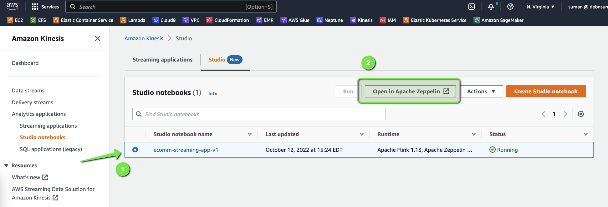

Once the **Zeppelin Dashboard** come up, click on `Import note` and import the [notebook](/code/flink-app/sql-flink-ecomm-notebook-1.zpln)

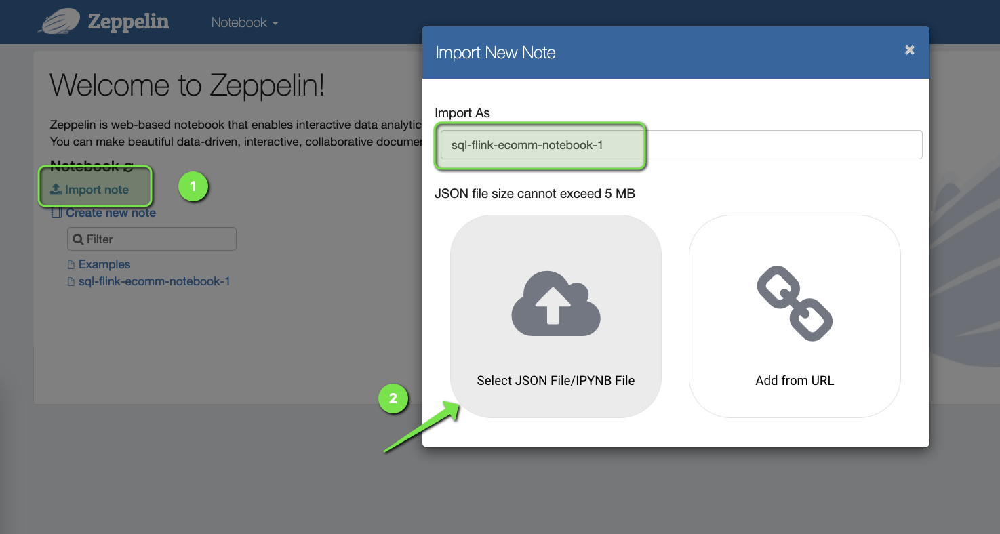

Open the `sql-flink-ecomm-notebook-1` notebook. We are going to use this Zeppelin notebook to create a **Flink Application** but before that lets go over this notebook and see what are we doing in this `Flink SQL code`

- First we are create a `table` for the incoming source of data (which is the `ecommerce-raw-user-activity-stream-1` incoming stream) 
- Next we are creating another `table` for the filtered data (which is for the `ecommerce-raw-user-activity-stream-2` outgoing stream)
- And finally we are putting the logic to stimulate the **DDoSS** attack. We are essentially looking into the last 10 seconds of the data and grouping that data by `user_id` and if we notice more than 5 records, we are taking that `user_id` and the no. of records and pushing it to the `ecommerce-raw-user-activity-stream-2` out going stream. Since we are working within a dummy environment, we can set the threshold record to any other number (not just 5, it could be anything), but the idea is to stimulate DDoS attack, and if we see same user (same `user_ud`) is adding/viewing/placing lets say, 5 products in last 10 seconds, we can assume its a DDoS/BOT attack, as it naturally not that feasible. We are hardcoding it just for this demo purpose, but in real world this might be coming dynamically from a configuration file.


```sql

%flink.ssql

/*Option 'IF NOT EXISTS' can be used, to protect the existing Schema */
DROP TABLE IF EXISTS ecomm_user_activity_stream_1;

CREATE TABLE ecomm_user_activity_stream_1 (
  `event_time` VARCHAR(30), 
  `event_type` VARCHAR(30), 
  `product_id` BIGINT, 
  `category_id` BIGINT, 
  `category_code` VARCHAR(30), 
  `brand` VARCHAR(30), 
  `price` DOUBLE, 
  `user_id` BIGINT, 
  `user_session` VARCHAR(30),
  `txn_timestamp` TIMESTAMP(3),
  WATERMARK FOR txn_timestamp as txn_timestamp - INTERVAL '10' SECOND  
)
PARTITIONED BY (category_id)
WITH (
  'connector' = 'kinesis',
  'stream' = 'ecommerce-raw-user-activity-stream-1',
  'aws.region' = 'us-east-1',
  'scan.stream.initpos' = 'LATEST',
  'format' = 'json',
  'json.timestamp-format.standard' = 'ISO-8601'
);

/*Option 'IF NOT EXISTS' can be used, to protect the existing Schema */
DROP TABLE IF EXISTS ecomm_user_activity_stream_2;

CREATE TABLE ecomm_user_activity_stream_2 (
  `user_id` BIGINT, 
  `num_actions_per_watermark` BIGINT
)
WITH (
  'connector' = 'kinesis',
  'stream' = 'ecommerce-raw-user-activity-stream-2',
  'aws.region' = 'us-east-1',
  'format' = 'json',
  'json.timestamp-format.standard' = 'ISO-8601'
);

/* Inserting aggregation into Stream 2*/
insert into ecomm_user_activity_stream_2
select  user_id, count(1) as num_actions_per_watermark
from ecomm_user_activity_stream_1
group by tumble(txn_timestamp, INTERVAL '10' SECOND), user_id
having count(1) > 5;

```

### Create the Apache Flink Application

Now, that we have our notebook imported, we can create the **Flink Application** from the notebook directly. 

- Click on `Actions for ecomm-streaming-app-v1` on the top right corner 

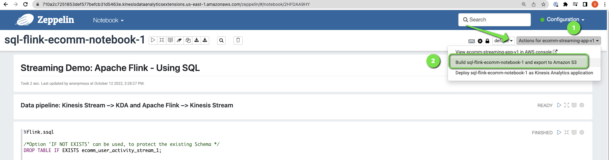

- Click on `Build sql-flink-ecomm-notebook-1` and then click on `Build and export`. It will compile all the code, will create a ZIP file and would store on S3 

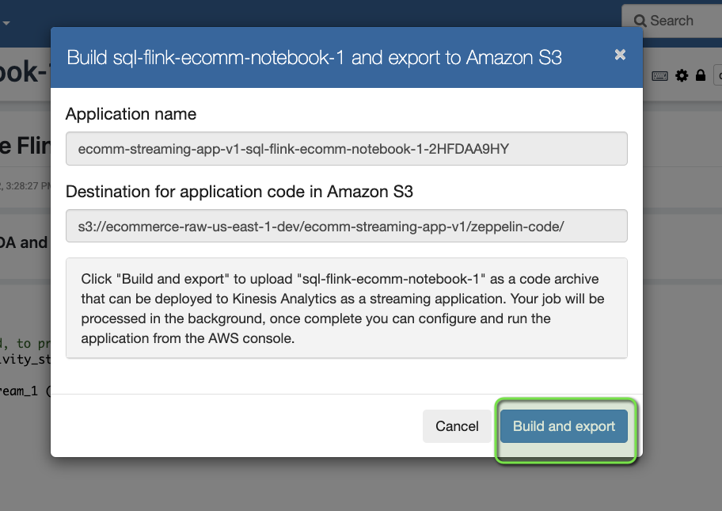

- And now we can deploy that application by simply clicking on `Actions for ecomm-streaming-app-v1` on the top right corner 

- Click on `Deploy sql-flink-ecomm-notebook-1 as Kinesis Analytics application` and then clicking on `Deploy using AWS Console` 

- Scroll down and click on `Save changes` 

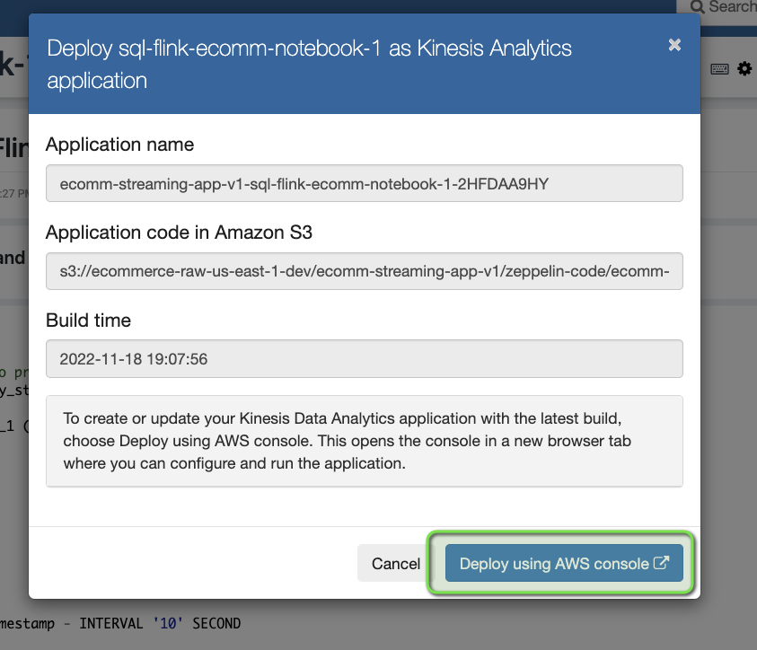

This is the power of **Kinesis Data Analytics** just from a simple Zeppelin Notebook we can create a real world application without any hindrance. 

- Finally we can start the application by clicking on **Run**. It might take couple of minutes to start the application so please wait till we see **Status** as `Running` 

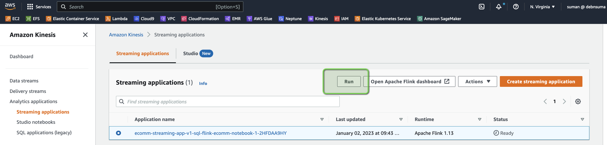 

### Alarming DDoS Attack 

If we revisit our architecture, we will see that we are almost done with the **online processing**, the only thing which is pending is to create a Lambda function which will be triggered whenever there is a record enters the `ecommerce-raw-user-activity-stream-2` stream which will write that data to some **DynamoDB** table and can also send an **SNS** notification. 

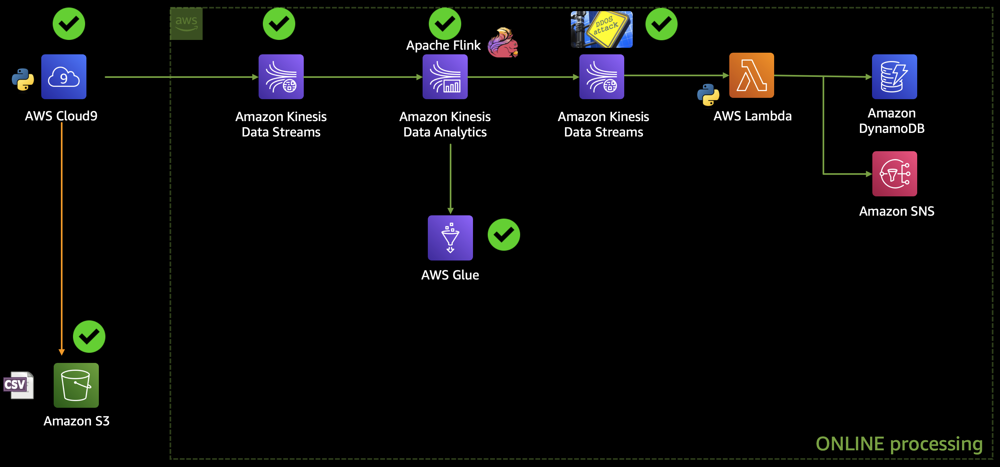 

Let's first build the code for the Lambda function 

```bash
# Install the aws_kinesis_agg package
cd code/serverless-app/
pip install aws_kinesis_agg -t .

# Build the lambda package and download the zip file.
zip -r ../lambda-package.zip .

# Upload the zip to S3
cd ..
aws s3 cp lambda-package.zip s3://ecommerce-raw-us-east-1-dev/src/lambda/

```

Now, lets create the Lambda function

- Open the **AWS Lambda** console 
- Click on **Create function** button 

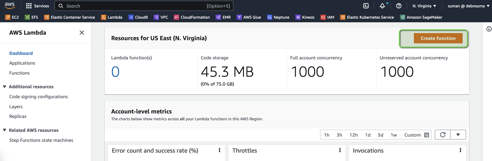 

- Enter the Function name as `ecomm-detect-high-event-volume` 
- Enter the Runtime as `Python 3.7`
- Click on **Create function**  

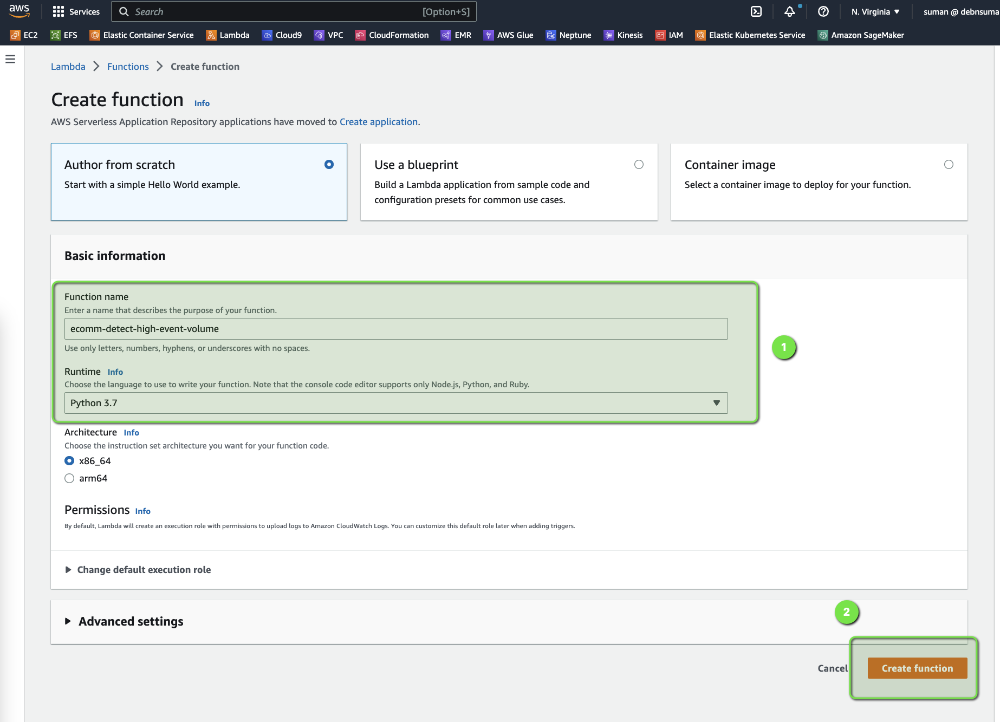 

Once the Lambda function is created we need to upload the code which we stored in Amazon S3. 

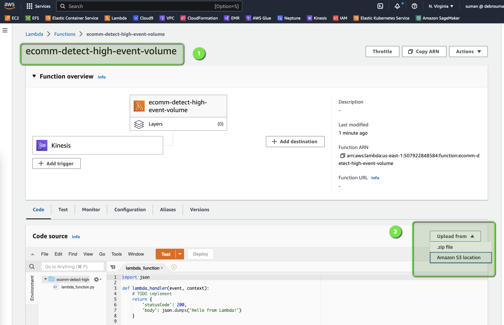 

Provide the location of the Lambda code which we uploaded on Amazon S3 in the previous step and click on **Save**  

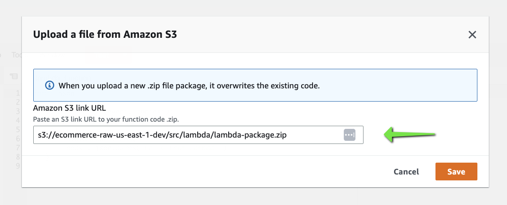 

We need to provide adequate privileges to our Lambda function so that it can talk to Kinesis Data Streams, DynamoDB, CloudWatch and SNS. Lets now modify the IAM Role. 

- Go to **Configuration** tab and them to **Permission** tab on the left
- Click on the IAM Role 

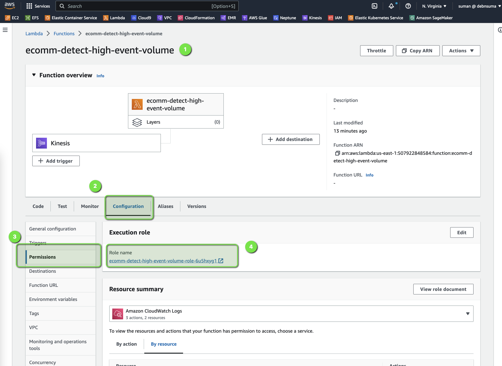 

Since this is just for this demo, we are adding Full Access, but its not at all recommended for production environment. We should always follow the least privilege principle. 

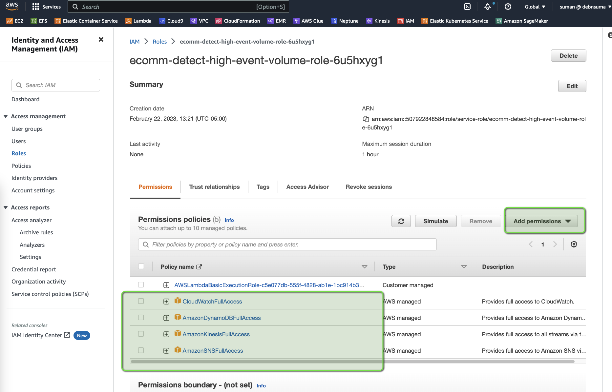 

Lets create the a SNS Topic

- Open the **Amazon SNS** console 
- Click on **Create Topic** 
- Select the Type as `Standard` 
- Provide the Name as `ecomm-user-high-severity-incidents` 
- Click on **Create Topic** 

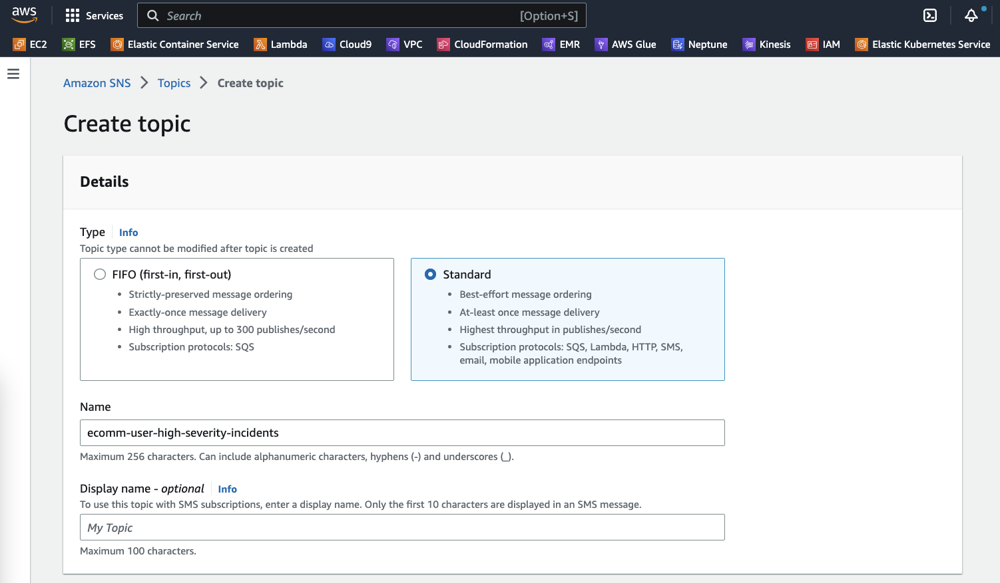 

Lets create a DynamoDB table 

- Open the **Amazon DynamoDB** console 
- Click on **Create table** 
- Create the table with the following details

    | Field | Value      | 
    | :-------- | :------- |
    | `Name`      | `ddb-ecommerce-tab-1` |
    | `Partition Key`      | `ddb_partition_key` |
    | `Secondary Key`      | `ddb_sort_key` |

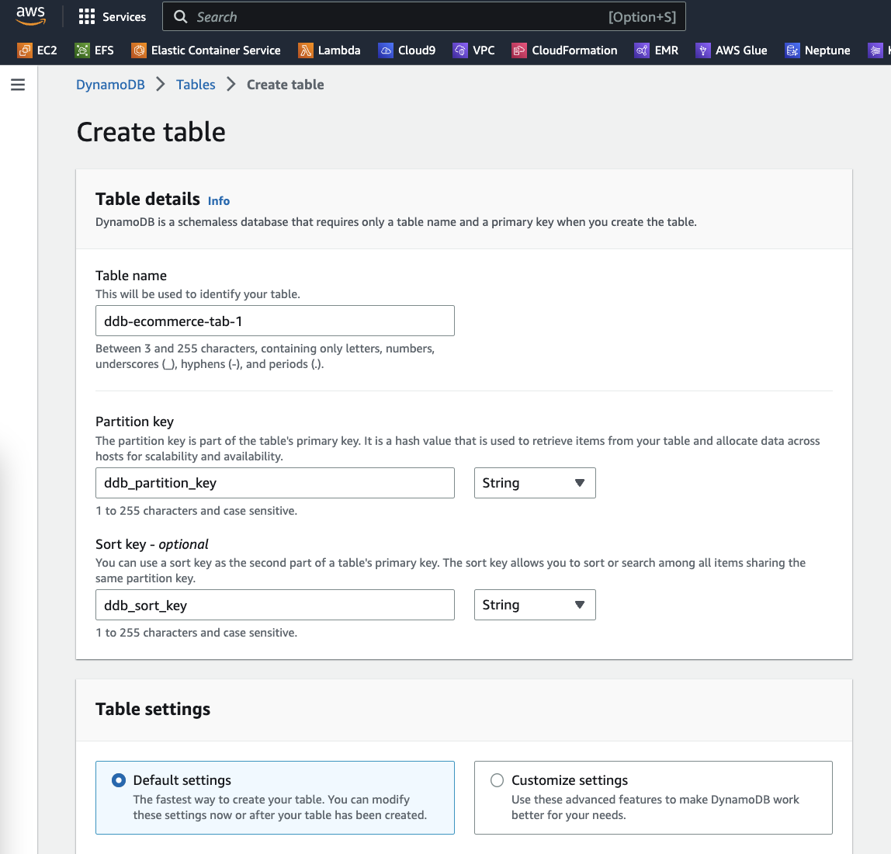 

Now, we can add the environment variables which are needed for the Lambda Function 

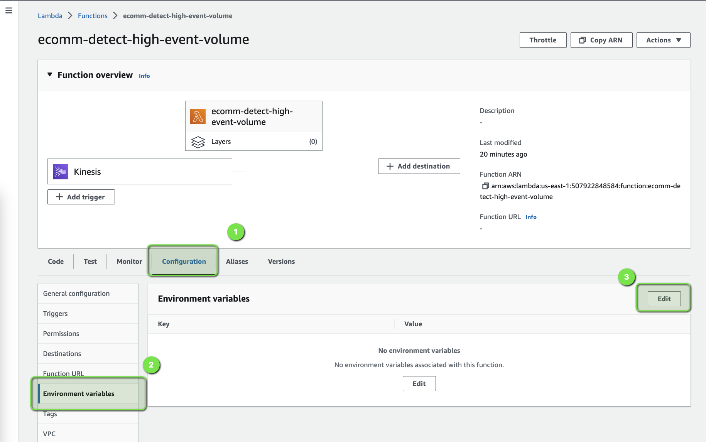 

Following are the environment variables:

| Key | Value      | 
| :-------- | :------- |
| `cloudwatch_metric`      | `ecomm-user-high-volume-events` |
| `cloudwatch_namespace`      | `ecommerce-namespace-1` |
| `dynamodb_control_table`      | `ddb-ecommerce-tab-1` |
| `topic_arn`      | `<Your SNS Topic ARN>` |


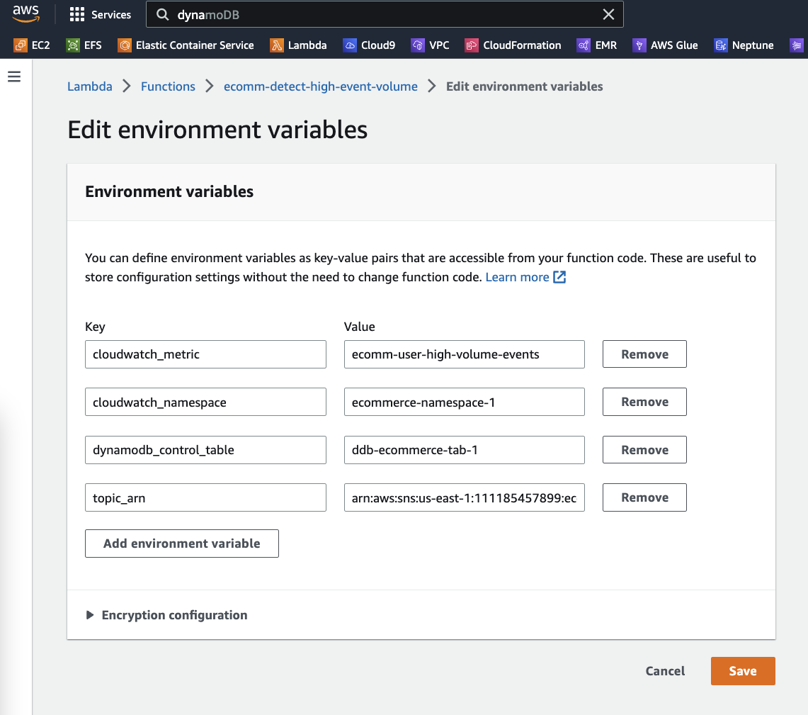 

## Show time 

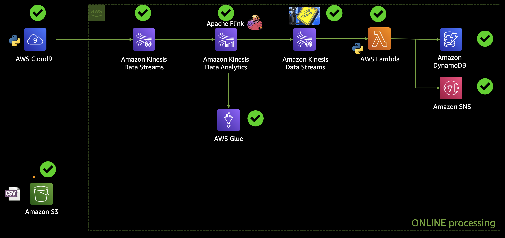 

So, now we are all done with the implementation, and its time to start generating the traffic using the `python script` which we created earlier. 


```bash
$ cd build-a-managed-analytics-platform-for-ecommerce-business 

$ python code/ecomm-simulation-app/stream-data-app-simulation.py 
HttpStatusCode: 200 ,  electronics.smartphone
HttpStatusCode: 200 ,  appliances.sewing_machine
HttpStatusCode: 200 ,  
HttpStatusCode: 200 ,  appliances.kitchen.washer
HttpStatusCode: 200 ,  electronics.smartphone
HttpStatusCode: 200 ,  computers.notebook
HttpStatusCode: 200 ,  computers.notebook
HttpStatusCode: 200 ,  
HttpStatusCode: 200 ,  
HttpStatusCode: 200 ,  electronics.smartphone
HttpStatusCode: 200 ,  furniture.living_room.sofa

```

We can also monitor this traffic using the **Apache Flink Dashboard** 

- Open the **Amazon Kinesis Application** dashboard 
- Select the Application, `ecomm-streaming-app-v1-sql-flink-ecomm-notebook-1-2HFDAA9HY` 
- Click on `Open Apache Flink dashboard` 

 

Once you are on the `Open Apache Flink dashboard`

- Click on `Running Jobs` and then click on the `Job Name` which is running 

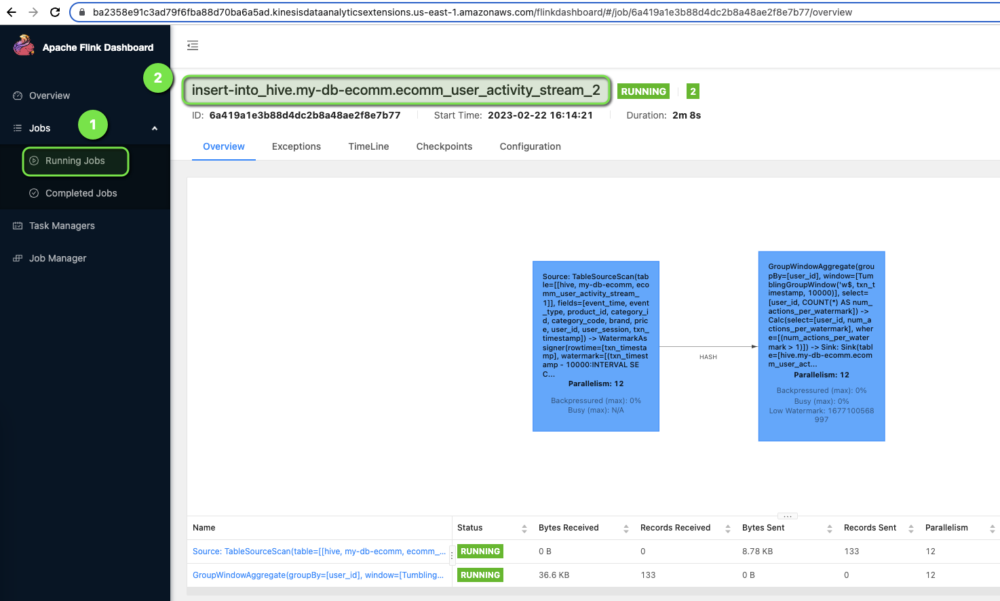 

And finally we can also see all the details of the users which are classified as a DDoS attack by the Flink Application in the `DynamoDB` table. 

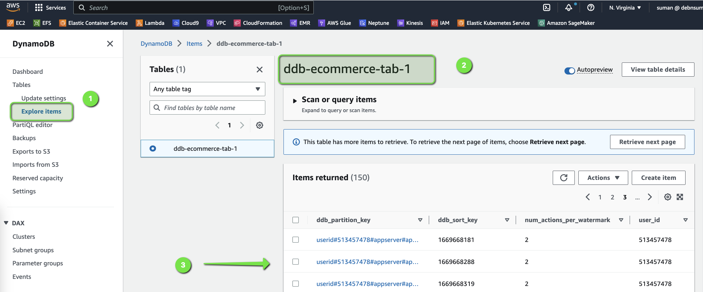 

You can let the stimulator run for next 5-10 mins while you explore and monitor all the components we have build in this whole data pipeline. 

## Summary 

In this blog post, we stimulate e-commerce shopping workload we used an eCommerce dataset to simulate the logs of user purchases, product views, cart history and the user’s journey on the online platform to create an Real time analytical platform .

We used a `python` script to stimulate the real traffic using the dataset, used Amazon Kinesis as the incoming stream of data. And that data is being analyzed by Amazon Kinesis Data Analytics using Apache Flink using `SQL`, which involves detecting Distributed denial of service (DDoS) and bot attacks using AWS Lambda, DynamoDB, CloudWatch, and AWS SNS.

In the second part of this blog series, we will dive deep and build the batch processing pipeline and build a dashboard using Amazon QuickSight, which will help us to get more insights about users. It will help us to know details like, who visits the ecommerce website more frequently, which are the top and bottom selling products, which are the top brands, and so on. 
