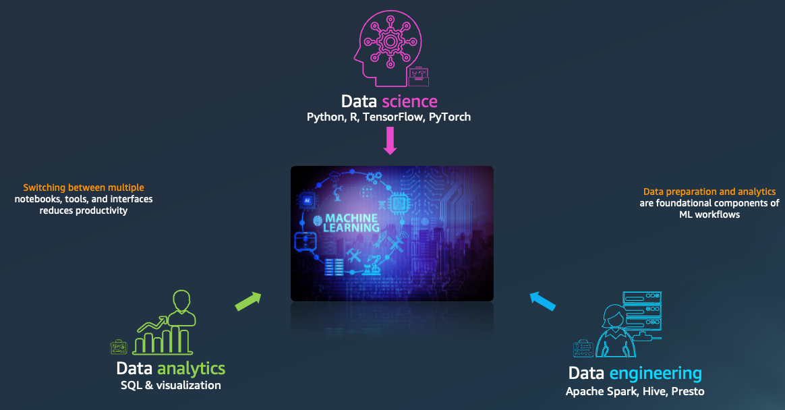
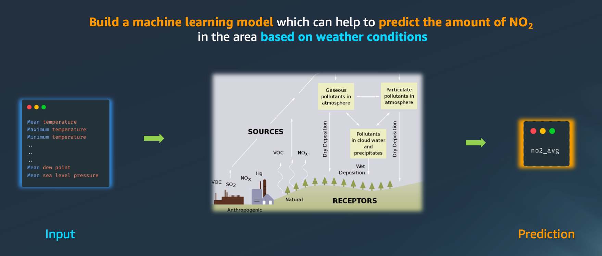
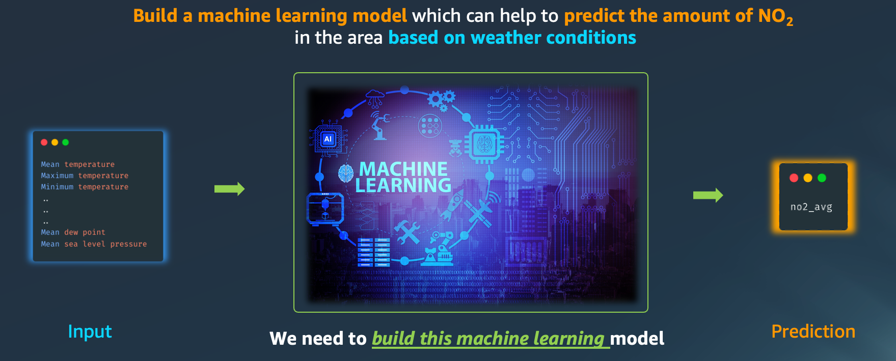
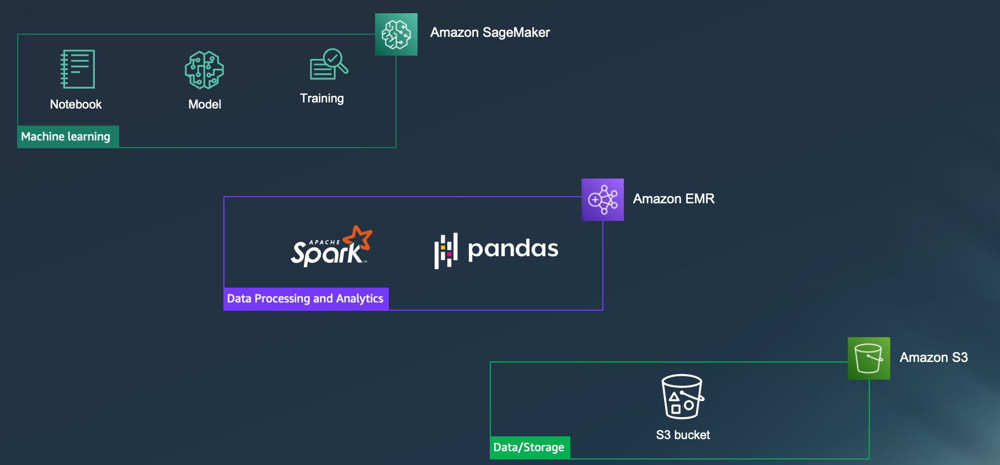
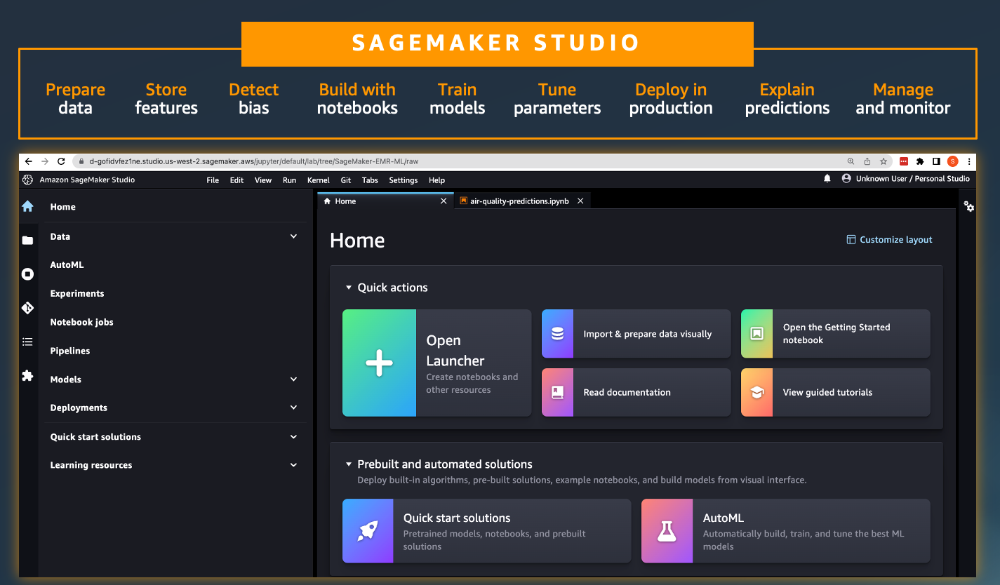
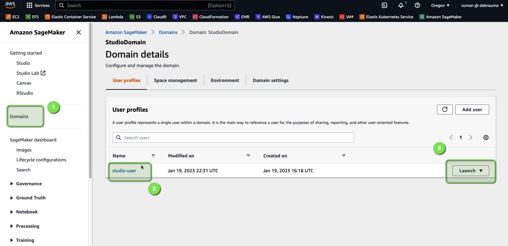

# Scalable data preparation & ML using Apache Spark on AWS 

Analyzing, transforming and preparing large amounts of data is a foundational step of any data science and ML workflow. This session shows how to build end-to-end data preparation and machine learning (ML) workflows. We explain how to connect Apache Spark, for fast data preparation in your data processing environments on Amazon EMR and AWS Glue interactive sessions from Amazon SageMaker Studio. Uncover how to access data governed by AWS Lake Formation to interactively query, explore, visualize data, run and debug Spark jobs as you prepare large-scale data for use in ML.

You may like to refer to session **Scalable data preparation & ML using Apache Spark on AWS** at [AWS Innovate 2023 (Data and Machine Learning)](https://aws.amazon.com/events/aws-innovate/apj/aiml-data/) for the code walk-through. 

## Introduction 

While some organizations see data science, data engineering, and data analytics as separate siloed functions, we're increasingly seeing with many of our customers that data prep and analytics are foundational components of ML workflows.

For example, although organizations have data engineering teams to clean and prepare data for analytics and ML, the specific data that a data scientist may need for training a specific model may not be available in the repository of data that a data engineering team may have prepared.

## Problem statement 

Lets take a problem and try to solve it. As we all know, Air pollution in cities can be an acute problem leading to damaging effects on people, animals, plants and property.

We need to build a machine learning model which can help to predict the amount of NO2 in the area based on weather conditions

So, ultimately we would like to have a ML model, wherein we are going to feed the weather details of a particular city at a given time, 
These details would be, mean temperature, maximum temperature, minimum temperate and so on. 

And the Model should predict the NO2 or nitrogen dioxide concentration levels at that time. 

## Solution 

So, what are the tasks we have in hand ? 

- We first need to clean and prepare the data for ML training and we are going to do that using `Apache Spark` 

- And then we would need to train and finally deploy the model using `Amazon SageMaker`. 

So, we are going to be using Amazon SageMaker for ML training, and Model hosting. We are going to use `Pandas` for data analysis and `Amazon EMR` for data processing. And our training dataset would be stored in an `Amazon S3` bucket. 

But we don’t have to worry about these multiple services and tools. 

## Amazon SageMaker Studio	

We are going to use Amazon SageMaker Studio, which is the first fully integrated development environment, or IDE, for machine learning. SageMaker Studio provides users the ability to visually browse and connect to Amazon EMR clusters right from the Studio notebook. Additionally, you can now provision and terminate EMR clusters directly from Studio

## Steps to follow 

In this section we will walk you through how you can create the environment and launch a Studio Notebook and perform the data processing and model training and deployment using Amazon SageMaker Studio Notebook and Amazon EMR. 

### Create the environment 

In this section, we supply AWS CloudFormation template and example notebooks to get started in a demonstration SageMaker domain.

The following stack provides an end-to-end CloudFormation template that stands up a private VPC, a SageMaker domain attached to that VPC, and a SageMaker user with visibility to the pre-created AWS Service Catalog product.

Please use this [CloudFormation template](/code/CFN-SagemakerEMRNoAuthProductWithStudio-v3.yaml) to deploy the environment. 

### Launch the SageMaker Studio Notebook 

Once the stack is deployed, perform the following to launch a SageMaker Studio Notebook

1. Open the **Amazon SageMaker** console
2. Click on `Domains` on the left menu. 
3. Click on `StudioDomain` 
4. Click on `Launch` button for the `studio-user` 

### Air Quality Predictions with Amazon SageMaker and Amazon EMR

Download this [Jupyter Notebook](/code/demo-sm-emr.ipynb) and import it inside the Studio Notebook and follow the instructions in the notebook. 

